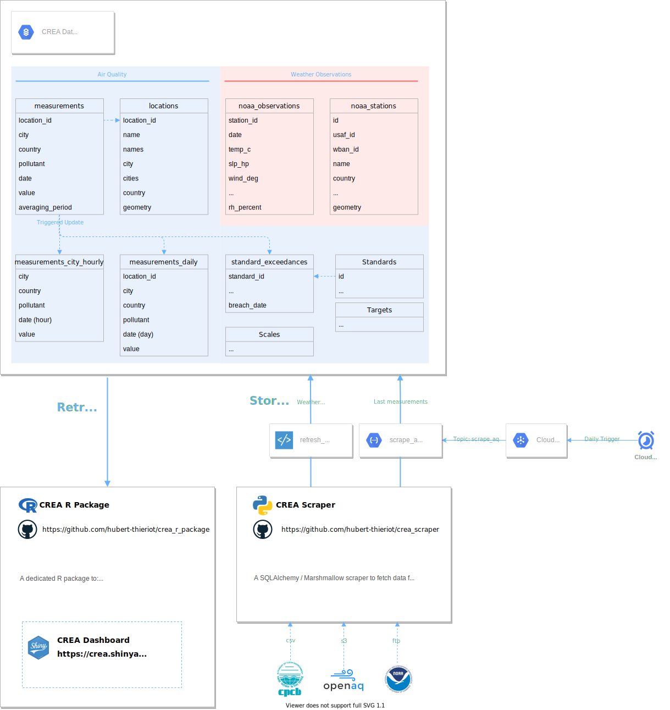

## Bigger picture
CREA Scraper is part of a larger ecosystem, as shown in the diagram below.




## Getting started
### Install
```
install.packages('devtools')
library(devtools)
url <- "https://github.com/hubert-thieriot/crea_r_package"
devtools::install_github(url)
```

In `.Renviron`, the following variables need to be defined:
-`GCS_AUTH_FILE="keys/gcs.shiny.auth.json"`

This auth file needs to be manually copied in the `inst/shiny/keys` directory.

## Usage
### Shiny Application
An online version is available on <https://crea.shinyapps.io/shiny/>.
Otherwise, you can run it locally using:
```
rcrea::runShinyApp()
```

### Markdown examples
Markdowns are available in the examples folder
```buildoutcfg
df_locations <- rcrea::locations(country='IN')
df_measurements <- rcrea::measurements(country='IN', poll=rcrea::PM25, city='Delhi')
``` 
